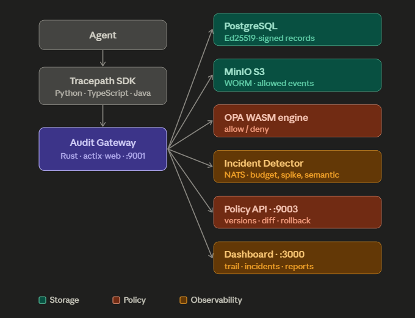

# Tracepath

**Auditable multi-agent middleware for AI governance.** Make any agent framework (LangChain, CrewAI, AutoGen, LangGraph) compliant with EU AI Act, FINRA, and SOC2 — in a single `docker compose up`.

> *"Can you audit what your agents did yesterday?"*
> Tracepath answers that with immutable Ed25519-signed logs, real-time policy enforcement, and a compliance dashboard.

> 🏆 **Submitted to [DEV Weekend Challenge: Passion Edition](https://dev.to/challenges/weekend-2026-07-09)** — Best Use of Google AI category

---

## Table of Contents

- [Quickstart](#quickstart)
- [What Tracepath Does](#what-tracepath-does)
- [Architecture](#architecture)
- [Dashboard](#dashboard)
- [API Reference](#api-reference)
- [Python SDK](#python-sdk)
- [Policy Engine](#policy-engine)
- [Incident Detection](#incident-detection)
- [Gemini Semantic Classifier](#gemini-semantic-classifier)
- [Compliance Reports](#compliance-reports)
- [Observability](#observability)
- [Roadmap](#roadmap)
- [License](#license)

---

## Quickstart

### Prerequisites

- Docker + Docker Compose
- Python 3.10+ (for SDK)
- Rust 1.80+ (for gateway development)

### 1. Start the stack

```bash
git clone https://github.com/nujovich/tracepath.git
cd tracepath/docker
AUDIT_SIGNING_KEY=$(openssl rand -hex 32) docker compose up -d
```

### 2. Open the dashboard

```
http://localhost:3000
```

Five tabs: **Audit**, **Incidents**, **Policies**, **Reports**, and **Gemini**.

### 3. Record your first audit step

```bash
curl -X POST http://localhost:9001/audit/step \
  -H "Content-Type: application/json" \
  -d '{
    "session_id":"demo","agent_id":"test","agent_type":"coder",
    "step_number":1,"tool_name":"read_file",
    "tool_input":{"path":"/tmp/test"},"tool_output":{"lines":10},
    "timestamp":"2026-07-12T12:00:00Z"
  }'
# → {"status":"recorded","signature":"<ed25519>","policy_decision":{"allowed":true,"denials":[]}}
```

### 4. Use the Python SDK

```python
from tracepath_sdk import AsyncAuditClient, audit

client = AsyncAuditClient(agent_type="coder")

@audit(client)
async def read_file(path: str) -> dict:
    return {"lines": 42}

async with client:
    result = await read_file(path="/tmp/x")
    events = await client.query_events(limit=10)
    incidents = await client.get_incidents()
```

---

## What Tracepath Does

Tracepath sits between your AI agent and the tools it calls. Every tool invocation is intercepted, signed, checked against policy, and stored in an immutable audit trail. A real-time incident detector watches for anomalies — denial spikes, budget overruns, suspicious patterns, and rate limit breaches — and surfaces them in a dashboard. An optional Gemini classifier refines severity using semantic analysis.

| Capability | How it works |
|---|---|
| **Sign every call** | Ed25519 signature per event → cryptographic non-repudiation |
| **Enforce policy** | OPA WASM engine evaluates allowlists, budgets, rate limits in <1ms |
| **Immutable audit log** | PostgreSQL (queryable) + MinIO S3 Object Lock (WORM, 365-day retention) |
| **Detect incidents** | NATS JetStream → real-time detector → dashboard alerts |
| **Classify severity** | Gemini 2.5 Flash via OpenRouter → semantic refinement of threshold-based alerts |
| **Version policies** | Git-based policy versioning with diff, rollback, and replay |
| **Generate reports** | One-click FINRA Rule 4511 and EU AI Act Article 50 compliance reports |
| **Multi-SDK** | Python (async + sync, `@audit` decorator), TypeScript, Java |

---

## Architecture



---

## Dashboard

)
*Gemini tab showing Enabled status, model info, and cached semantic classifications.*

)
*Incidents tab with real-time detection timeline: CRITICAL denial spikes, WARNING budget overruns.*

)
*Policies tab with git version history, side-by-side diff viewer, and one-click rollback.*

)
*Reports tab with one-click FINRA and EU AI Act compliance report generation.*

)
*Audit tab with event trail, policy decision breakdown, and tool usage stats.*

---

## API Reference

| Method | Path | Description |
|---|---|---|
| `GET` | `/health` | Gateway health |
| `GET` | `/health/policy` | OPA policy engine smoke test |
| `POST` | `/audit/step` | Record an audit step (signed + policy-checked) |
| `GET` | `/audit/events` | Query audit events (filtered: `session_id`, `agent_id`, `tool_name`; paginated) |
| `GET` | `/incidents` | Query incidents detected by the incident service |
| `GET` | `/reports` | List generated compliance reports |
| `POST` | `/reports/generate` | Generate a compliance report (`type: "finra" \| "eu-ai-act"`) |
| `GET` | `/reports/{name}` | Download a specific report file |
| `GET` | `/gemini` | Gemini classifier status and cached classifications |
| `GET` | `/policies/versions` | List policy versions (git history) |
| `GET` | `/policies/diff?old=<hash>&new=<hash>` | Unified diff between two policy versions |
| `POST` | `/policies/rollback` | Rollback to a previous policy version |

---

## Python SDK

```python
from tracepath_sdk import AsyncAuditClient, SyncAuditClient, audit, PolicyDenied

# ── Async client with decorator ──────────────────
client = AsyncAuditClient(agent_type="coder")

@audit(client)
async def read_file(path: str) -> dict:
    return {"lines": 42}

async with client:
    # Auto-audited call
    result = await read_file(path="/tmp/x")

    # Manual audit
    resp = await client.record_step("terminal", {"cmd": "ls"}, {"exit": 0})

    # Query the audit trail
    events = await client.query_events(session_id=client.session_id)
    print(f"{events.count} events recorded")

    # Check for incidents
    for inc in await client.get_incidents():
        print(f"[{inc.severity}] {inc.type}: {inc.message}")

# ── Sync client ──────────────────────────────────
with SyncAuditClient(agent_type="researcher") as sync:
    sync.record_step("web_search", {"q": "test"}, {"results": 3})
    print(sync.health())
```

### SDK features

| Feature | API |
|---|---|
| Async client | `AsyncAuditClient` with `async with` context manager |
| Sync client | `SyncAuditClient` thin wrapper for scripts |
| `@audit` decorator | Wraps any async/sync function; tool name = function name |
| Policy denied detection | `PolicyDenied` exception with `.denials` list and `.signature` |
| Audit trail query | `query_events(session_id, agent_id, tool_name, limit, offset)` |
| Incident timeline | `get_incidents(limit)` |
| Pydantic models | `AuditResponse`, `AuditQueryResult`, `Incident`, `PolicyDecision` |
| Tests | 14 tests (7 unit + 7 integration) |

---

## Policy Engine

Three base policies, compiled to OPA WASM and evaluated at the gateway:

| Policy | Rule |
|---|---|
| **Allowlist** | Reject tools not in the agent type's allowed set |
| **Budget** | Reject if cumulative tool cost exceeds session budget |
| **Rate limit** | Reject if >60 calls/minute per session |

### Agent type allowlists

| Agent type | Allowed tools |
|---|---|
| `coder` | `read_file`, `write_file`, `terminal`, `search_files`, `patch`, `execute_code` |
| `researcher` | `web_search`, `web_extract`, `browser_navigate`, `browser_snapshot` |
| `assistant` | `read_file`, `web_search`, `web_extract`, `terminal` |
| `default` | `read_file`, `web_search`, `web_extract` |

### Recompiling policies

```bash
cd policies
opa build -t wasm -e tracepath/main/decision -o bundle.tar.gz rules/
# Restart gateway to load the new bundle
```

---

## Incident Detection

Real-time anomaly detection with NATS JetStream streaming.

| Detector | Trigger | Severity |
|---|---|---|
| **Denial spike** | >5 policy denials in a single session | CRITICAL |
| **Budget exceeded** | >1000 cost cents accumulated per session | WARNING |
| **Suspicious pattern** | ≥10 consecutive calls to the same tool | WARNING |
| **Rate limit breach** | >60 calls/minute per session | WARNING |

### Detection pipeline

```
Audit event → Gateway → NATS JetStream → Incident Detector (Python)
                                              │
                                              ├─ Threshold pass (Rego-like rules)
                                              ├─ Gemini refinement (semantic pass)
                                              └─ Incident persisted → Dashboard API
```

---

## Gemini Semantic Classifier

Powered by **Google Gemini 2.5 Flash** via OpenRouter. Takes threshold-triggered incidents and refines their severity by analyzing the semantic context.

| Incident | Original Severity | Gemini Reasoning | Final Severity |
|---|---|---|
| 6 `image_generate` denials in a session | CRITICAL | *"All denials were for image generation, suggesting a misconfiguration rather than a malicious attempt"* | WARNING |
| Budget exceeded by 2x | WARNING | *"The tools used match a legitimate research workflow"* | INFO |

### Backend support

- **OpenRouter** — set `OPENROUTER_API_KEY` (recommended)
- **Google AI native** — set `GOOGLE_API_KEY`

```bash
# With OpenRouter
OPENROUTER_API_KEY=sk-or-v1-... docker compose up -d

# Or set the model explicitly
OPENROUTER_MODEL=google/gemini-2.5-flash docker compose up -d
```

### Persistent cache

All Gemini classifications are cached to disk (`/data/gemini-cache.json`) and survive container restarts. The dashboard shows the classification history with reasoning for every incident.

---

## Compliance Reports

One-click generation of regulatory reports, directly from the dashboard.

| Report | Standard | Status |
|---|---|---|
| **FINRA** | Rule 4511 (Books and Records) | ✅ Compliant |
| **EU AI Act** | Article 50 (Transparency & Oversight) | ✅ Compliant |

Each report validates:
- **Data Integrity** — Ed25519 signatures on every event
- **Record Retention** — WORM storage with 365-day minimum
- **Access Controls** — API-level authentication
- **Searchable Records** — Full PostgreSQL query capability
- **Human Oversight** — Dashboard-based monitoring and intervention

---

## Observability

The gateway exports traces to **LangFuse** via OTLP (HTTP). Disabled by default — enable with:

```bash
export OTEL_EXPORTER_OTLP_ENDPOINT="https://cloud.langfuse.com/api/public/otel"
export OTEL_SERVICE_NAME="tracepath-gateway"
export LANGFUSE_PUBLIC_KEY="pk-lf-..."
export LANGFUSE_SECRET_KEY="sk-lf-..."
```

When unset, the gateway logs to stdout (JSON) with zero OTLP overhead.

---

## Roadmap

### Now (Weekend Build — complete ✅)

- [x] Ed25519 signing per event
- [x] OPA WASM policy engine (allowlist, budget, rate limit)
- [x] PostgreSQL audit log with query API
- [x] WORM storage (MinIO S3 Object Lock)
- [x] NATS JetStream event bus
- [x] Real-time incident detection (4 detectors)
- [x] Git-based policy versioning (diff + rollback + replay)
- [x] FINRA + EU AI Act compliance reports
- [x] Gemini 2.5 Flash semantic classifier (via OpenRouter)
- [x] React dashboard (5 tabs)
- [x] Python SDK (async + sync, `@audit` decorator)
- [x] TypeScript SDK
- [x] Java SDK

### Next (weeks 1–4)

- [ ] **Helm chart** — deploy to any Kubernetes cluster
- [ ] **PDF reports** — FINRA/EU AI Act as downloadable PDFs
- [ ] **Webhook alerts** — Slack, Discord, PagerDuty for critical incidents
- [ ] **Custom policy UI** — write and test Rego rules directly in the dashboard
- [ ] **TypeScript SDK parity** — `@audit` decorator + full feature parity with Python SDK

### Soon (months 1–3)

- [ ] **SOC2 readiness package** — pre-built evidence collection for SOC2 auditors
- [ ] **AWS Marketplace listing** — one-click deploy from AWS console
- [ ] **Multi-tenant dashboard** — organization-level scoping and RBAC
- [ ] **Replay engine end-to-end** — full historical replay with comparison reports
- [ ] **LangFuse integration** — native OpenTelemetry export with pre-built dashboards

### Vision (6+ months)

- [ ] **Policy marketplace** — share and import community OPA policies
- [ ] **Federated audit** — cross-organization audit trail sharing with zero-knowledge proofs
- [ ] **Agent scoring** — compliance score per agent/session, visible in dashboard
- [ ] **Real-time intervention** — auto-pause agents when critical incidents are detected

---

## License

Apache 2.0

---

*Built with ❤️‍🔥 by [Nadia Ujovich](https://github.com/nujovich)*